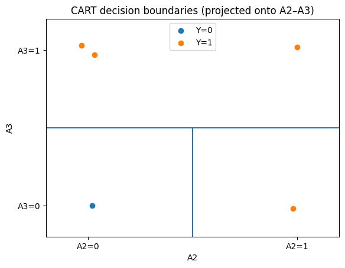
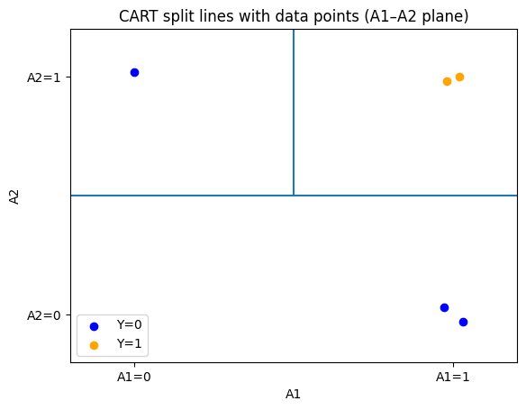

# 2.1 CART: worked reference example

The original solution develops the reference dataset step by step. We reproduce that calculation first because it shows exactly how CART evaluates candidate splits.

| $A_1$ | $A_2$ | $A_3$ | $Y$ |
|---:|---:|---:|---:|
| 0 | 0 | 1 | 1 |
| 1 | 0 | 1 | 1 |
| 1 | 1 | 1 | 1 |
| 0 | 0 | 0 | 0 |
| 0 | 1 | 0 | 1 |

For binary classification,

$$
G=1-(p_0^2+p_1^2),
$$

and for a split,

$$
G_{\text{split}}=\frac{n_L}{n}G_L+\frac{n_R}{n}G_R.
$$

CART selects the split with the smallest weighted impurity.

## Step 1: Compute impurity at the root

There are five observations. Class $Y=1$ appears four times and class $Y=0$ appears once, so

$$
p_1=\frac45=0.8,
\qquad
p_0=\frac15=0.2.
$$

Hence

$$
G_{\text{root}}
=1-(0.8^2+0.2^2)
=1-(0.64+0.04)
=0.32.
$$

## Step 2: Evaluate the split on $A_1$

For $A_1=0$, the observations are rows 1, 4, and 5 with targets $1,0,1$. Thus

$$
p_1=\frac23,
\qquad
p_0=\frac13,
$$

and

$$
G_L=1-\left(\frac23\right)^2-\left(\frac13\right)^2
=\frac49\approx0.4444.
$$

For $A_1=1$, rows 2 and 3 both have $Y=1$, so the right child is pure:

$$
G_R=0.
$$

The weighted impurity is therefore

$$
G_{\text{split}}(A_1)
=\frac35\left(\frac49\right)+\frac25(0)
=\frac4{15}
\approx0.2667.
$$

## Step 3: Evaluate the split on $A_2$

For $A_2=0$, rows 1, 2, and 4 have targets $1,1,0$, so

$$
G_L=\frac49\approx0.4444.
$$

For $A_2=1$, rows 3 and 5 both have $Y=1$, so

$$
G_R=0.
$$

Thus

$$
G_{\text{split}}(A_2)
=\frac35\left(\frac49\right)+\frac25(0)
\approx0.2667.
$$

## Step 4: Evaluate the split on $A_3$

For $A_3=0$, rows 4 and 5 have targets $0,1$, giving

$$
G_L
=1-\left(\frac12\right)^2-\left(\frac12\right)^2
=0.5.
$$

For $A_3=1$, rows 1, 2, and 3 all have $Y=1$, so

$$
G_R=0.
$$

Therefore

$$
G_{\text{split}}(A_3)
=\frac25(0.5)+\frac35(0)
=0.2.
$$

## Step 5: Choose the best root split

The candidate weighted impurities are

$$
G(A_1)\approx0.2667,
\qquad
G(A_2)\approx0.2667,
\qquad
G(A_3)=0.2.
$$

The smallest value is obtained with $A_3$, so CART chooses **$A_3$ as the root split**.

The branch $A_3=1$ is already pure and predicts $Y=1$. We only need to continue with the mixed branch $A_3=0$.

## Step 6: Continue splitting the node $A_3=0$

This subset contains rows 4 and 5:

| Row | $A_1$ | $A_2$ | $A_3$ | $Y$ |
|---:|---:|---:|---:|---:|
| 4 | 0 | 0 | 0 | 0 |
| 5 | 0 | 1 | 0 | 1 |

At this node, $A_1$ and $A_3$ are constant, so neither can separate the two observations. Only $A_2$ changes.

Splitting on $A_2$ gives

- $A_2=0$: one observation with $Y=0$, impurity $0$;
- $A_2=1$: one observation with $Y=1$, impurity $0$.

The weighted impurity is therefore

$$
\frac12(0)+\frac12(0)=0.
$$

This is a perfect separation.

## Final learned tree

The resulting rules are:

1. If $A_3=1$, predict $Y=1$.
2. If $A_3=0$ and $A_2=0$, predict $Y=0$.
3. If $A_3=0$ and $A_2=1$, predict $Y=1$.

{width="4.8in" fig-align="center"}

> **ML insight: greedy impurity reduction**
>
> CART chooses the best split **at the current node**. It does not directly optimize the final tree as one global object. In this example, $A_3$ produces the largest immediate reduction in impurity. Once that split is made, only the remaining mixed region needs another partition.

# 2.2 Applying the same procedure to the exercise dataset

For the exercise dataset, the target values are $0,0,0,1,1$, so

$$
G_{\text{root}}
=1-\left(\frac35\right)^2-\left(\frac25\right)^2
=0.48.
$$

The weighted root impurities are

$$
G(A_1)=0.40,
\qquad
G(A_2)\approx0.2667,
\qquad
G(A_3)\approx0.4667.
$$

Therefore the best root split is $A_2$.

The branch $A_2=0$ is pure and predicts class $0$. In the branch $A_2=1$, the three remaining observations are

| Example | $A_1$ | $A_3$ | $Y$ |
|---:|---:|---:|---:|
| 3 | 0 | 0 | 0 |
| 4 | 1 | 1 | 1 |
| 5 | 1 | 0 | 1 |

Splitting this node on $A_1$ makes both children pure, giving weighted impurity $0$. The resulting rules are therefore

- if $A_2=0$, predict $Y=0$;
- if $A_2=1$ and $A_1=0$, predict $Y=0$;
- if $A_2=1$ and $A_1=1$, predict $Y=1$.

{width="4.8in" fig-align="center"}
