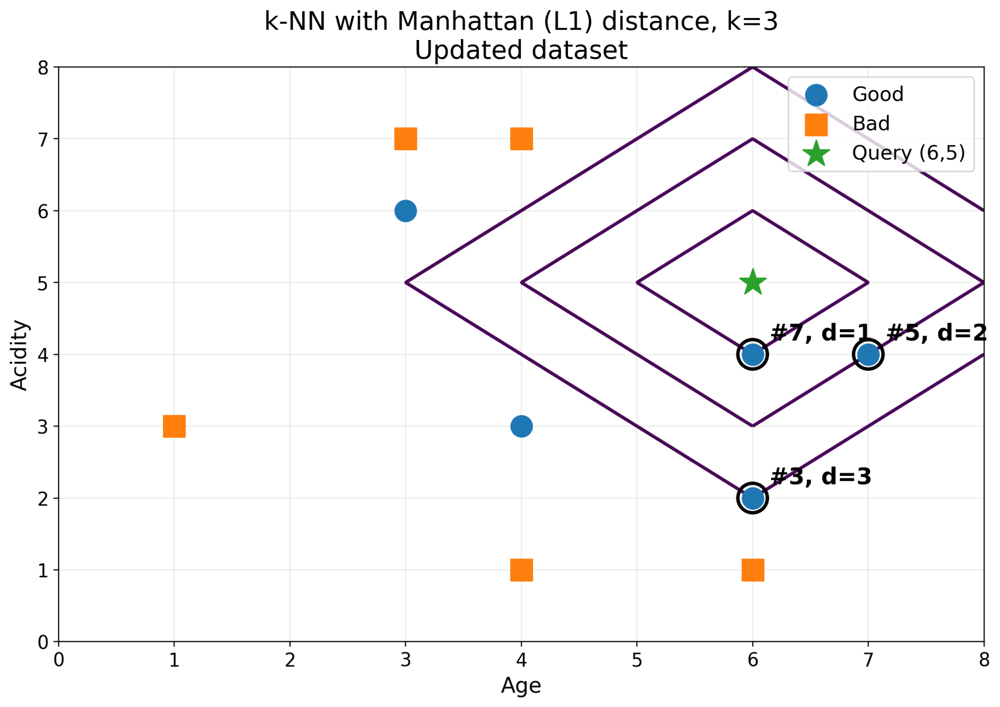
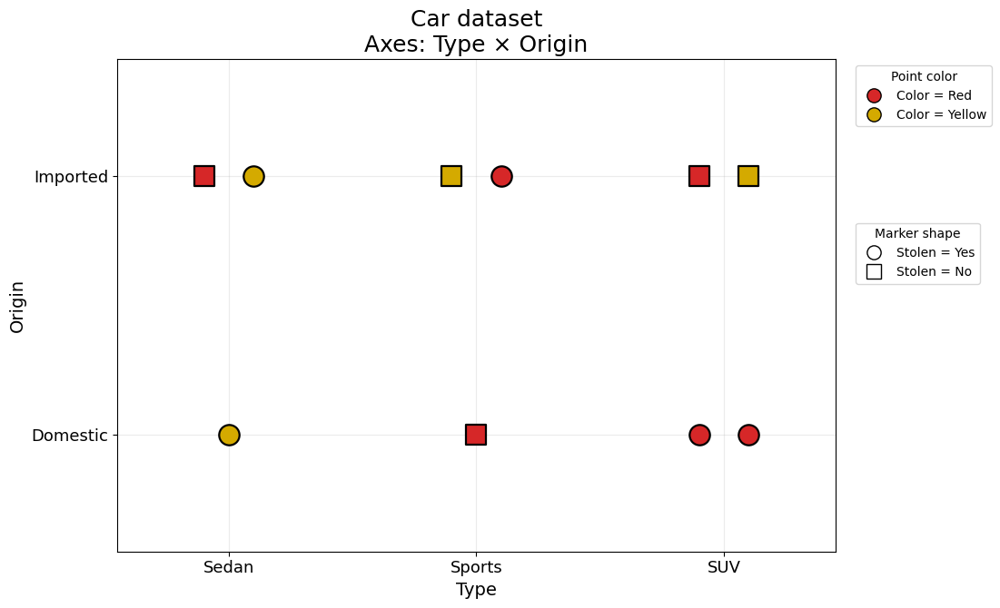
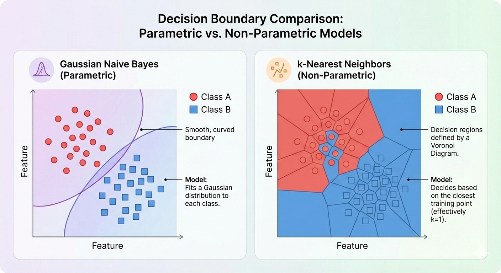
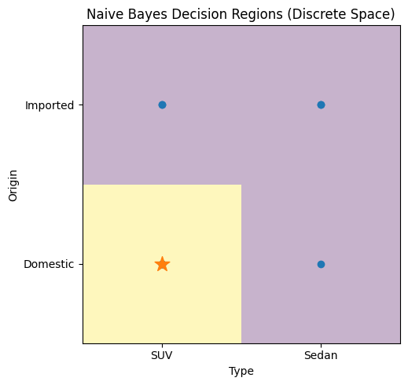

# 3.1 k-nearest neighbors and Naive Bayes

## 3.1.1 Numerical features and Manhattan distance

Consider a survey designed to understand how customers evaluate the **Quality** of beverages, classified as **Good** or **Bad**. Each beverage is characterized by two features: **Age** (time bottled) and **Acidity**.

| Example | Age | Acidity | Quality |
|---:|---:|---:|:---|
| 1 | 4 | 3 | Good |
| 2 | 1 | 3 | Bad |
| 3 | 6 | 2 | Good |
| 4 | 3 | 7 | Bad |
| 5 | 7 | 4 | Good |
| 6 | 4 | 1 | Bad |
| 7 | 6 | 4 | Good |
| 8 | 4 | 7 | Bad |
| 9 | 3 | 6 | Good |
| 10 | 6 | 1 | Bad |

Using a k-NN classifier with the Manhattan distance, predict the evaluation of a beverage with

$$
\text{Age}=6,
\qquad
\text{Acidity}=5,
$$

for $k=3$.

For every training example $i$, compute

$$
d_i=|\text{Age}_i-6|+|\text{Acidity}_i-5|.
$$

{width="5.7in" fig-align="center"}

The query $(6,5)$ is shown as a green star. The lines around it illustrate equal-Manhattan-distance contours. In the fiugre, the three nearest examples are highlighted.

| Example | $(\text{Age},\text{Acidity})$ | Quality | Distance |
|---:|:---:|:---:|---:|
| 7 | $(6,4)$ | Good | $0+1=1$ |
| 5 | $(7,4)$ | Good | $1+1=2$ |
| 3 | $(6,2)$ | Good | $0+3=3$ |

Because these three neighbors are all from the same class, majority voting predicts **Good** for the query.

However, the important computational step is to calculate the distance to **all ten observations** and then order them by proximity. The table above only shows the final top-$k$ neighbors. Complete the full distance calculation yourself.

**Note on ties.** The fourth-smallest distance occurs for several observations. If a tie occurred at the $k$-th neighbor, the implementation would need an explicit tie-breaking convention.

1. Compute all ten Manhattan distances.
2. Sort the observations from nearest to farthest.
3. Confirm the $k=3$ prediction.
4. Explain how the prediction could change as $k$ increases.
5. Relate $k$ to the locality and smoothness of the resulting decision regions.

## 3.1.2 Categorical features

Now consider a car dataset with predictors **Color, Type, Origin, Transmission, Fuel** and target **Stolen**.

| Ex. | Color | Type | Origin | Transmission | Fuel | Stolen? |
|---:|:---|:---|:---|:---|:---|:---|
| 1 | Red | SUV | Domestic | Automatic | Gasoline | Yes |
| 2 | Red | SUV | Domestic | Automatic | Diesel | Yes |
| 3 | Red | SUV | Imported | Manual | Gasoline | Yes |
| 4 | Red | SUV | Imported | Manual | Gasoline | No |
| 5 | Red | Sedan | Imported | Manual | Diesel | No |
| 6 | Yellow | Sedan | Imported | Manual | Diesel | Yes |
| 7 | Yellow | Sports | Imported | Manual | Diesel | Yes |
| 8 | Yellow | SUV | Imported | Automatic | Diesel | No |
| 9 | Red | Sports | Imported | Automatic | Diesel | Yes |
| 10 | Yellow | Sports | Domestic | Manual | Diesel | No |
| 11 | Yellow | Sedan | Domestic | Manual | Diesel | Yes |

The figure below shows only part of the feature space: **Type** on one axis and **Origin** on the other. Color is encoded visually and the marker shape represents the target. **Transmission and Fuel are deliberately not shown.** As dimensionality increases, no single 2D plot can display every feature used by the classifier.

{width="5.5in" fig-align="center"}

For categorical variables, use a mismatch/Hamming-style distance:

$$
d(\mathbf{x},\mathbf{q})
=\sum_j \mathbb{1}(x_j\neq q_j).
$$

Classify the query

$$
q=(\text{Red, SUV, Domestic, Automatic, Gasoline})
$$

using k-NN with $k=3$.

1. Compute the mismatch distance from the query to every observation.
2. Identify the three nearest neighbors and predict the target by majority vote.
3. Consider what happens for $k=5$, including the possibility of ties at the neighbor cutoff.
4. The query would appear near the bottom-right of the 2D Type-versus-Origin projection. Is that projection alone sufficient to infer the true k-NN prediction? Explain why or why not.

### Decision-boundary interpretation

In a **continuous** feature space, k-NN produces irregular, locally defined, Voronoi-like decision regions because the prediction depends on nearby observations. Naive Bayes, by contrast, produces a **global probabilistic decision rule** determined by estimated class probabilities and class-conditional feature distributions.

In a **discrete** feature space, the idea of a smooth geometric boundary is less literal: the classifier assigns a class to each possible combination of feature values. The important intuition is that, even for the same data, different learning algorithms divide or organize the feature space according to different assumptions, and those assumptions can lead to different predictions.

{width="5.7in" fig-align="center"}

## 3.1.3 Naive Bayes guided example

Consider the following reduced dataset, where the target indicates whether a car was stolen and the predictors are **Color, Type, and Origin**.

| Example | Color | Type | Origin | Stolen? |
|---:|:---|:---|:---|:---|
| 1 | Red | SUV | Domestic | Yes |
| 2 | Red | SUV | Imported | Yes |
| 3 | Red | Sedan | Domestic | No |
| 4 | Yellow | SUV | Domestic | No |
| 5 | Yellow | Sedan | Imported | No |
| 6 | Red | SUV | Domestic | Yes |
| 7 | Yellow | SUV | Imported | No |
| 8 | Red | Sedan | Imported | No |

We want to classify

$$
X=(\text{Red, SUV, Domestic}).
$$

Naive Bayes compares the posterior probabilities of the possible classes. Ignoring the common normalization term $P(X)$, the prediction can be obtained by comparing

$$
P(Y=c)\prod_j P(X_j=x_j\mid Y=c).
$$

The calculation therefore proceeds in three stages.

1. **Class priors.** Count how many observations belong to each class and compute $P(Y=\text{Yes})$ and $P(Y=\text{No})$.
2. **Class-conditioned feature probabilities.** Within each class, determine the proportion of observations that are Red, SUV, and Domestic.
3. **Combine the probabilities.** Multiply the class prior by the class-conditioned probabilities for each candidate class and compare the resulting scores.

The key reversal of perspective is that we do not directly count how often a given feature vector belongs to each class. Instead, we estimate how likely each class is to generate the observed feature values and then use Bayes' rule to compare the classes.

Complete the full calculation for both classes and predict whether the query is stolen.

Once the class-conditional probabilities have been estimated, Naive Bayes assigns each possible discrete feature combination to the class with the larger posterior score. The resulting decision regions can therefore be viewed as a partition of the discrete feature space.

{width="5.0in" fig-align="center" fig-cap="Example of the discrete decision regions induced by Naive Bayes over Type and Origin. The star marks the query combination."}

> **ML insight: local versus global inductive bias**
>
> k-NN bases a prediction on local proximity to stored observations. Naive Bayes builds a global probabilistic model and combines feature evidence under a conditional-independence assumption. The same training set can therefore induce very different partitions of the feature space.
