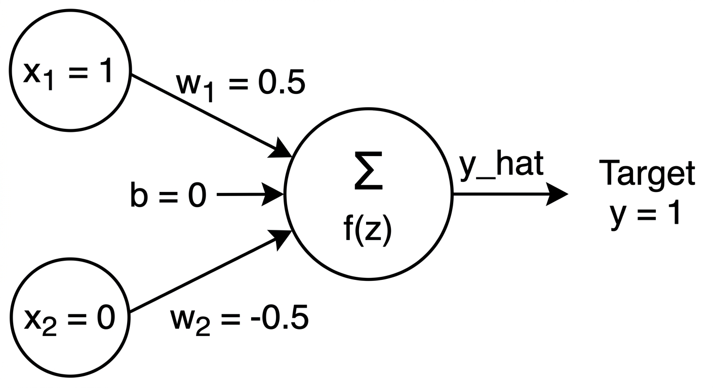
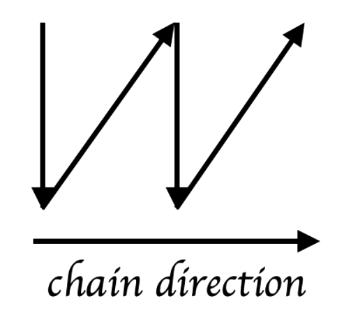

# 4.1 Neural networks

## 4.1.1 A single neuron

Consider a neural network composed of **one neuron** with two inputs

$$
x_1=1,
\qquad
x_2=0,
$$

weights

$$
w_1=0.5,
\qquad
w_2=-0.5,
$$

bias

$$
b=0,
$$

and target

$$
y=1.
$$

{width="5.0in" fig-align="center"}

The neuron first computes the linear combination

$$
z=w_1x_1+w_2x_2+b,
$$

then applies the sigmoid activation

$$
\hat y=\sigma(z)=\frac{1}{1+e^{-z}},
$$

and measures its error with the squared loss

$$
L=\frac12(y-\hat y)^2.
$$

### 1. Forward pass

Carry out a complete forward pass by computing:

1. the linear combination $z$;
2. the sigmoid prediction $\hat y$;
3. the loss $L$.

At the beginning of training, weights and biases are usually initialized before the network has learned the task. The forward pass therefore tells us how far the current prediction is from the target. Backpropagation uses that error to determine how each parameter contributed to the loss.

### 2. Backpropagation

Compute the derivatives in the order induced by the computational graph:

$$
\frac{\partial L}{\partial \hat y}=\hat y-y,
$$

$$
\frac{\partial \hat y}{\partial z}
=\hat y(1-\hat y),
$$

and therefore

$$
\frac{\partial L}{\partial z}
=\frac{\partial L}{\partial \hat y}
\frac{\partial \hat y}{\partial z}.
$$

Because

$$
\frac{\partial z}{\partial w_1}=x_1,
\qquad
\frac{\partial z}{\partial w_2}=x_2,
\qquad
\frac{\partial z}{\partial b}=1,
$$

use the chain rule to compute

$$
\frac{\partial L}{\partial w_1},
\qquad
\frac{\partial L}{\partial w_2},
\qquad
\frac{\partial L}{\partial b}.
$$

### 3. Parameter update

With learning rate

$$
\eta=0.1,
$$

update every parameter using gradient descent:

$$
\theta_{\text{new}}
=\theta_{\text{old}}-\eta\frac{\partial L}{\partial \theta}.
$$

Compute the new values of $w_1$, $w_2$, and $b$. Then explain the **sign and magnitude** of the updates. In particular, what happens to the gradient of the weight connected to $x_2=0$?

### Note on the chain rule

Think of the chain rule as a chain reaction or a system of gears. If turning Gear A once turns Gear B twice, and turning Gear B once turns Gear C three times, then turning Gear A once turns Gear C six times: $2\times3=6$.

The same idea is used in a neural network. We multiply the **local rates of change** along a path to determine the total effect of an earlier quantity on the final loss. Backpropagation repeatedly applies this idea from the output layer back toward the parameters that produced the prediction.

{width="2.3in" fig-align="center"}

# 4.2 A neural network for XOR

A single linear neuron cannot represent XOR, so we now use a two-layer neural network. The input layer connects to two hidden sigmoid neurons; the hidden activations then connect to a sigmoid output neuron.

Use

$$
w_1=w_2=w_3=w_4=1,
$$

$$
b_1=-1.5,
\qquad
b_2=-0.5,
\qquad
b_3=0,
$$

and output-layer weights

$$
v_1=1,
\qquad
v_2=-2.
$$

The network architecture is shown below.

{width="5.6in" fig-align="center"}

The XOR truth table is

| $x_1$ | $x_2$ | $y$ |
|---:|---:|---:|
| 0 | 0 | 0 |
| 0 | 1 | 1 |
| **1** | **0** | **1** |
| 1 | 1 | 0 |

Use the third row,

$$
(x_1,x_2)=(1,0),
\qquad y=1.
$$

The hidden layer computes

$$
z_1=w_1x_1+w_2x_2+b_1,
\qquad
h_1=\sigma(z_1),
$$

$$
z_2=w_3x_1+w_4x_2+b_2,
\qquad
h_2=\sigma(z_2).
$$

The output unit computes

$$
z_3=v_1h_1+v_2h_2+b_3,
\qquad
\hat y=\sigma(z_3),
$$

and the loss is again

$$
L=\frac12(y-\hat y)^2.
$$

## 4.2.1 Forward pass

1. Compute $z_1$ and $h_1$.
2. Compute $z_2$ and $h_2$.
3. Compute $z_3$ and $\hat y$.
4. Compute the loss.

## 4.2.2 Backpropagation

Begin at the output neuron:

1. Compute $\partial L/\partial \hat y$.
2. Compute $\partial \hat y/\partial z_3$.
3. Compute $\delta_3=\partial L/\partial z_3$.
4. Use $\delta_3$ to obtain the gradients for $v_1$, $v_2$, and $b_3$.

Then continue through each hidden neuron:

5. Compute the error signal reaching hidden neuron 1 and obtain gradients for $w_1$, $w_2$, and $b_1$.
6. Compute the error signal reaching hidden neuron 2 and obtain gradients for $w_3$, $w_4$, and $b_2$.

Finally, answer:

1. Why can a **single neuron not solve XOR**?
2. What role does the **hidden layer** play in making XOR learnable?
3. How does the **chain rule** allow gradients to flow through the network?

> **ML insight: representation and optimization are different ideas**
>
> The hidden layer determines what nonlinear intermediate representation the network can construct. Backpropagation provides the gradients used to adjust the parameters of the chosen architecture.
