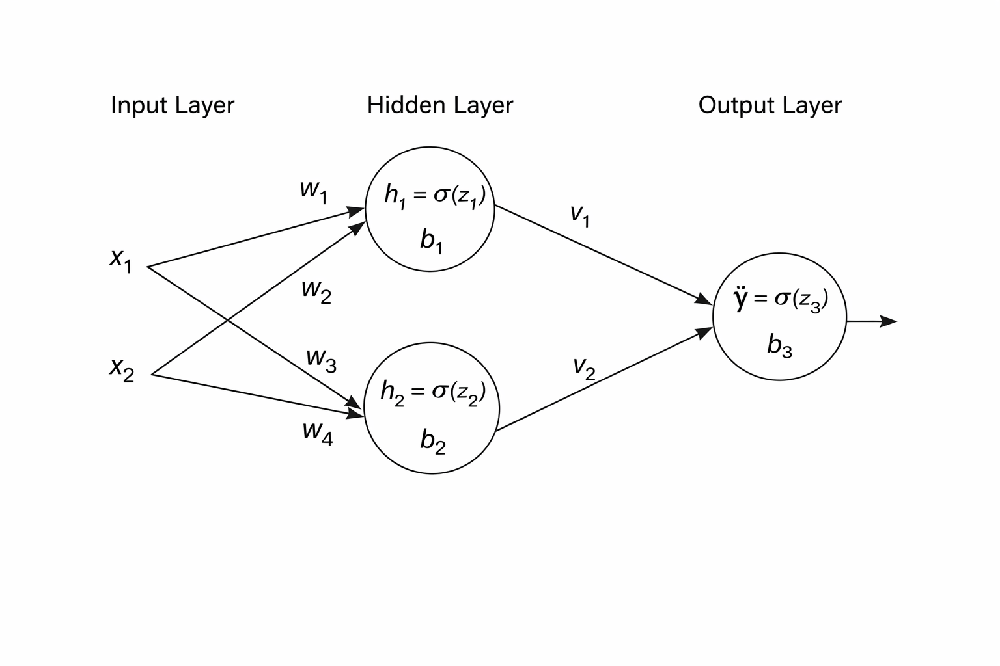

# 4.1 Single neuron: worked solution

We have

$$
z=w_1x_1+w_2x_2+b,
\qquad
\hat y=\sigma(z),
\qquad
L=\frac12(y-\hat y)^2,
$$

with

$$
x_1=1,
\quad x_2=0,
\quad w_1=0.5,
\quad w_2=-0.5,
\quad b=0,
\quad y=1.
$$

## 1. Forward pass

### Step 1: Compute the linear combination

$$
\begin{aligned}
z
&=(0.5)(1)+(-0.5)(0)+0\\
&=0.5.
\end{aligned}
$$

The second weight contributes nothing in this example because its input is zero.

### Step 2: Compute the prediction

$$
\begin{aligned}
\hat y
&=\sigma(0.5)\\
&=\frac{1}{1+e^{-0.5}}\\
&\approx0.62246.
\end{aligned}
$$

The neuron currently predicts approximately $0.6225$. Since the target is $1$, the prediction is on the correct side of $0.5$, but it is still not equal to the target.

### Step 3: Compute the loss

$$
\begin{aligned}
L
&=\frac12(1-0.62246)^2\\
&\approx0.07127.
\end{aligned}
$$

The forward pass is therefore

$$
\boxed{z=0.5,\quad \hat y\approx0.62246,\quad L\approx0.07127}.
$$

# 4.2 Backpropagation through the single neuron

Backpropagation starts from the loss and follows the computational chain backwards.

## Step 1: Derivative of the loss with respect to the prediction

For

$$
L=\frac12(y-\hat y)^2,
$$

we have

$$
\frac{\partial L}{\partial \hat y}=\hat y-y.
$$

Therefore

$$
\frac{\partial L}{\partial \hat y}
=0.62246-1
\approx-0.37754.
$$

The derivative is negative: increasing the prediction would reduce the loss because the target is larger than the current prediction.

## Step 2: Derivative of the sigmoid

For a sigmoid output,

$$
\frac{\partial \hat y}{\partial z}
=\hat y(1-\hat y).
$$

Thus

$$
\frac{\partial \hat y}{\partial z}
=(0.62246)(1-0.62246)
\approx0.23500.
$$

## Step 3: Chain the two derivatives

$$
\begin{aligned}
\frac{\partial L}{\partial z}
&=\frac{\partial L}{\partial \hat y}
  \frac{\partial \hat y}{\partial z}\\
&\approx(-0.37754)(0.23500)\\
&\approx-0.08872.
\end{aligned}
$$

This quantity is often called the local error signal, or delta, for the neuron.

## Step 4: Gradients of the parameters

Since

$$
z=w_1x_1+w_2x_2+b,
$$

we have

$$
\frac{\partial z}{\partial w_1}=x_1=1,
\qquad
\frac{\partial z}{\partial w_2}=x_2=0,
\qquad
\frac{\partial z}{\partial b}=1.
$$

Therefore

$$
\frac{\partial L}{\partial w_1}
=\frac{\partial L}{\partial z}x_1
\approx-0.08872,
$$

$$
\frac{\partial L}{\partial w_2}
=\frac{\partial L}{\partial z}x_2
=0,
$$

and

$$
\frac{\partial L}{\partial b}
\approx-0.08872.
$$

The zero gradient for $w_2$ has a direct interpretation: for this example, $x_2=0$, so changing $w_2$ cannot change $z$, the prediction, or the loss.

# 4.3 Weight update

With learning rate $\eta=0.1$, gradient descent uses

$$
\theta_{\text{new}}
=\theta_{\text{old}}-\eta\frac{\partial L}{\partial \theta}.
$$

Therefore

$$
\begin{aligned}
w_1'
&=0.5-0.1(-0.08872)\\
&\approx0.50887,
\end{aligned}
$$

$$
w_2'=-0.5-0.1(0)=-0.5,
$$

and

$$
\begin{aligned}
b'
&=0-0.1(-0.08872)\\
&\approx0.00887.
\end{aligned}
$$

So the updated parameters are

$$
\boxed{w_1'\approx0.50887,\quad w_2'=-0.5,\quad b'\approx0.00887}.
$$

The update raises $z$ for this example, which moves $\hat y$ closer to the target $1$ and therefore reduces the loss.

> **ML insight: a gradient measures sensitivity**
>
> The gradient of a parameter is the local sensitivity of the loss to that parameter. Backpropagation computes those sensitivities efficiently by reusing intermediate derivatives instead of independently perturbing every weight.

# 4.4 Two-layer network for XOR: worked solution

Use

$$
w_1=w_2=w_3=w_4=1,
$$

$$
b_1=-1.5,
\quad b_2=-0.5,
\quad b_3=0,
$$

$$
v_1=1,
\quad v_2=-2,
$$

with input $(x_1,x_2)=(1,0)$ and target $y=1$.

{width="5.6in" fig-align="center"}

## 1. Hidden-layer forward pass

For hidden neuron 1,

$$
\begin{aligned}
z_1
&=w_1x_1+w_2x_2+b_1\\
&=(1)(1)+(1)(0)-1.5\\
&=-0.5,
\end{aligned}
$$

so

$$
h_1=\sigma(-0.5)\approx0.37754.
$$

For hidden neuron 2,

$$
\begin{aligned}
z_2
&=w_3x_1+w_4x_2+b_2\\
&=(1)(1)+(1)(0)-0.5\\
&=0.5,
\end{aligned}
$$

so

$$
h_2=\sigma(0.5)\approx0.62246.
$$

The hidden representation passed to the output neuron is therefore

$$
(h_1,h_2)\approx(0.37754,0.62246).
$$

## 2. Output-layer forward pass

$$
\begin{aligned}
z_3
&=v_1h_1+v_2h_2+b_3\\
&=(1)(0.37754)+(-2)(0.62246)+0\\
&\approx-0.86738.
\end{aligned}
$$

The prediction is

$$
\hat y=\sigma(-0.86738)\approx0.29580.
$$

## 3. Loss

$$
\begin{aligned}
L
&=\frac12(1-0.29580)^2\\
&\approx0.24795.
\end{aligned}
$$

The current network prediction is below the target, so training should adjust the parameters in directions that increase the output for this input.

# 4.5 Backpropagation through the two-layer network

The main difference from the single-neuron case is that the output error must now be propagated through the output weights and then through each hidden activation.

## 4.5.1 Output-layer gradients

First,

$$
\frac{\partial L}{\partial \hat y}
=\hat y-y
\approx-0.70420.
$$

The sigmoid derivative at the output is

$$
\frac{\partial \hat y}{\partial z_3}
=\hat y(1-\hat y)
\approx(0.29580)(0.70420)
\approx0.20829.
$$

Therefore

$$
\delta_3
=\frac{\partial L}{\partial z_3}
\approx(-0.70420)(0.20829)
\approx-0.14669.
$$

Because

$$
z_3=v_1h_1+v_2h_2+b_3,
$$

we obtain

$$
\frac{\partial L}{\partial v_1}
=\delta_3h_1
\approx(-0.14669)(0.37754)
\approx-0.05538,
$$

$$
\frac{\partial L}{\partial v_2}
=\delta_3h_2
\approx(-0.14669)(0.62246)
\approx-0.09131,
$$

and

$$
\frac{\partial L}{\partial b_3}
=\delta_3
\approx-0.14669.
$$

## 4.5.2 Hidden neuron 1

The output error reaches hidden neuron 1 through $v_1$. Thus

$$
\delta_1
=\delta_3v_1h_1(1-h_1).
$$

Substituting the values,

$$
\delta_1
\approx(-0.14669)(1)(0.37754)(0.62246)
\approx-0.03447.
$$

Since

$$
z_1=w_1x_1+w_2x_2+b_1,
$$

we have

$$
\frac{\partial L}{\partial w_1}
=\delta_1x_1
\approx-0.03447,
$$

$$
\frac{\partial L}{\partial w_2}
=\delta_1x_2
=0,
$$

and

$$
\frac{\partial L}{\partial b_1}
=\delta_1
\approx-0.03447.
$$

Again, the weight multiplying $x_2$ receives zero gradient for this specific input because $x_2=0$.

## 4.5.3 Hidden neuron 2

The error reaches hidden neuron 2 through the output weight $v_2=-2$:

$$
\delta_2
=\delta_3v_2h_2(1-h_2).
$$

Therefore

$$
\delta_2
\approx(-0.14669)(-2)(0.62246)(0.37754)
\approx0.06894.
$$

Hence

$$
\frac{\partial L}{\partial w_3}
=\delta_2x_1
\approx0.06894,
$$

$$
\frac{\partial L}{\partial w_4}
=\delta_2x_2
=0,
$$

and

$$
\frac{\partial L}{\partial b_2}
=\delta_2
\approx0.06894.
$$

The sign differs from hidden neuron 1 because the path from hidden neuron 2 to the output contains the negative weight $v_2=-2$.

## Final gradient summary

Output layer:

$$
\boxed{
\frac{\partial L}{\partial v_1}\approx-0.05538,
\quad
\frac{\partial L}{\partial v_2}\approx-0.09131,
\quad
\frac{\partial L}{\partial b_3}\approx-0.14669
}
$$

Hidden neuron 1:

$$
\boxed{
\frac{\partial L}{\partial w_1}\approx-0.03447,
\quad
\frac{\partial L}{\partial w_2}=0,
\quad
\frac{\partial L}{\partial b_1}\approx-0.03447
}
$$

Hidden neuron 2:

$$
\boxed{
\frac{\partial L}{\partial w_3}\approx0.06894,
\quad
\frac{\partial L}{\partial w_4}=0,
\quad
\frac{\partial L}{\partial b_2}\approx0.06894
}
$$

# 4.6 Conceptual answers

## Why can a single neuron not solve XOR?

A single neuron followed by a monotonic activation creates a decision boundary based on one linear combination of the inputs. XOR is not linearly separable: no single straight line can place the two positive XOR cases on one side and the two negative cases on the other.

## What role does the hidden layer play?

The hidden layer creates intermediate nonlinear features. Instead of asking the output unit to separate the raw coordinates directly, it receives a transformed representation $(h_1,h_2)$. This extra representation can make a pattern separable even when it is not separable in the original feature space.

## How does the chain rule allow gradients to flow?

The loss depends on an early-layer weight only through a sequence of intermediate quantities. The chain rule multiplies the local derivatives along that sequence. Backpropagation organizes those products efficiently, allowing the output error to be propagated backward through each layer to every parameter that contributed to the prediction.

> **ML insight: backpropagation follows paths in the computational graph**
>
> A weight receives a gradient only through the paths by which it can influence the loss. The signs and magnitudes along those paths determine the final update. This is why the same output error can produce different gradients in different hidden units.
