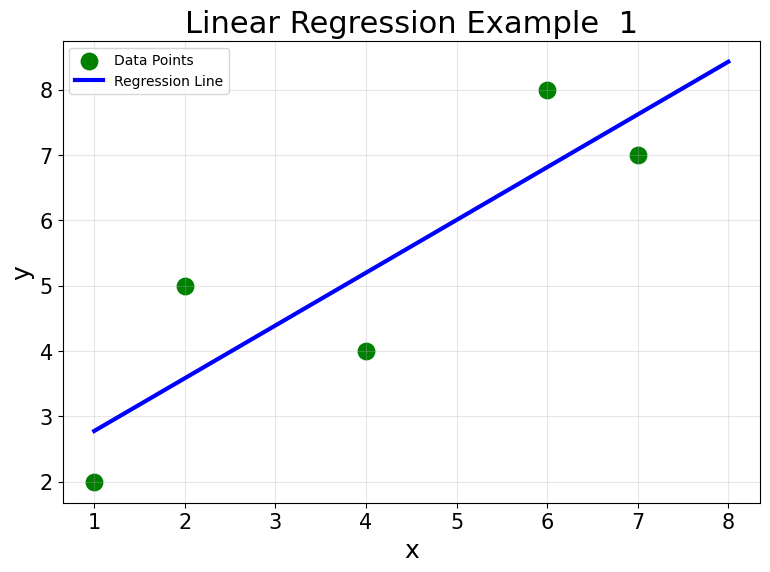
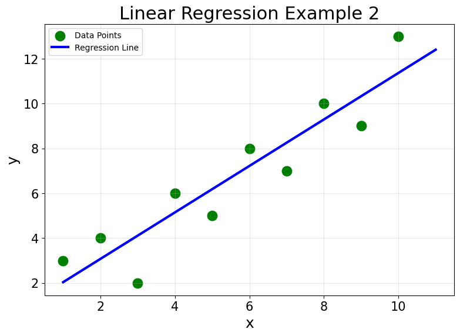
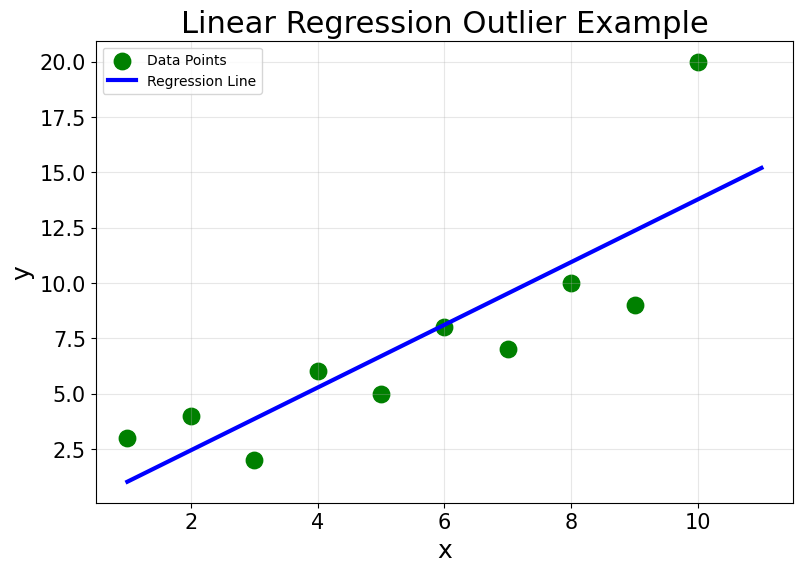

# 5.1 Linear regression

Linear regression is a simple but powerful approach that uses a linear function to model the relationship between predictors $x$ and a continuous target $y$, assuming that new observations follow approximately the same relationship. As the name indicates, it is used for regression tasks.

## 1. Parameter estimation

Consider the dataset below, where a single feature $x$ is related to a target $y$.

| Example | $x$ | $y$ |
|---:|---:|---:|
| 1 | 1 | 2 |
| 2 | 2 | 5 |
| 3 | 4 | 4 |
| 4 | 6 | 8 |
| 5 | 7 | 7 |

{width="5.2in" fig-align="center"}

The plot shows the model we want to obtain: a line fitted to all five observations. Intuitively, we want the line to be, on average, as close as possible to the observed targets. One way to formalize this is to minimize the **Mean Squared Error (MSE)**,

$$
\operatorname{MSE}
=\frac1n\sum_{i=1}^{n}(y_i-\hat y_i)^2.
$$

A simple linear regression model has the form

$$
\hat y=w_0+w_1x,
$$

where $w_1$ is the slope and $w_0$ is the intercept. For ordinary least squares with one predictor,

$$
w_1
=\frac{\sum_{i=1}^{n}(x_i-\bar x)(y_i-\bar y)}
       {\sum_{i=1}^{n}(x_i-\bar x)^2},
$$

and

$$
w_0=\bar y-w_1\bar x.
$$

The fitted line always passes through the point $(\bar x,\bar y)$. Rearranging the intercept equation gives

$$
\bar y=w_0+w_1\bar x,
$$

which means that at the average input value, the fitted model predicts the average target value.

The slope formula also has a useful interpretation. The numerator measures how $x$ and $y$ vary together: observations that are simultaneously above or below their respective means contribute positively, whereas observations that move in opposite directions contribute negatively. The denominator measures how much the input values vary around their mean. The slope is therefore determined by the joint variation of $x$ and $y$ relative to the spread of $x$.

Your task is to compute:

1. the average input and target values, $\bar x$ and $\bar y$;
2. the numerator and denominator of $w_1$;
3. the parameters $w_1$ and $w_0$;
4. the final regression equation.

## 2. Prediction

Using the regression equation obtained above, compute the prediction for

$$
x=6.
$$

## 3. Mean Squared Error

Using the same fitted model:

1. compute all fitted values $\hat y_i$;
2. compute every residual

$$
e_i=y_i-\hat y_i;
$$

3. square the residuals and compute the final MSE by averaging them.

## 4. Two larger datasets

Now consider the following two datasets. The input values are identical. Only the final target changes.

### Dataset (a)

| Example | $x$ | $y$ |
|---:|---:|---:|
| 1 | 1 | 3 |
| 2 | 2 | 4 |
| 3 | 3 | 2 |
| 4 | 4 | 6 |
| 5 | 5 | 5 |
| 6 | 6 | 8 |
| 7 | 7 | 7 |
| 8 | 8 | 10 |
| 9 | 9 | 9 |
| 10 | 10 | 13 |

{width="5.2in" fig-align="center"}

### Dataset (b)

| Example | $x$ | $y$ |
|---:|---:|---:|
| 1 | 1 | 3 |
| 2 | 2 | 4 |
| 3 | 3 | 2 |
| 4 | 4 | 6 |
| 5 | 5 | 5 |
| 6 | 6 | 8 |
| 7 | 7 | 7 |
| 8 | 8 | 10 |
| 9 | 9 | 9 |
| 10 | 10 | **20** |

{width="5.2in" fig-align="center"}

For **each** dataset, use the same formulas as before to:

1. compute $\bar x$ and $\bar y$;
2. compute $w_1$ and $w_0$;
3. write the fitted regression equation.

## 5. Predictions, residuals, and the outlier

For every observation in both datasets:

1. compute the fitted value $\hat y_i$;
2. compute the residual $e_i=y_i-\hat y_i$;
3. identify the observation with the largest absolute residual;
4. inspect the signs and magnitudes of the residuals and note whether they appear roughly unstructured or whether a systematic pattern is visible.

The fitted lines in both plots generally follow the trend of the observations. In dataset (b), however, the point $(10,20)$ is far from both the rest of the sample and the fitted line. It is an **outlier**.

To isolate the effect of this single extreme observation, compare the two fitted models:

- How much does the slope change from dataset (a) to dataset (b)?
- How does the intercept change?
- Compare the predictions for the same $x$ values in the two datasets. How do they differ as $x$ increases?
- Does changing one observation affect only its local neighborhood, or does it change predictions throughout the fitted line?

Because linear regression is a **global model**, all observations contribute to the fitted parameters. In addition, ordinary least squares minimizes **squared** residuals, so large deviations receive disproportionately high weight in the objective. A single extreme observation can therefore noticeably change both slope and intercept and, consequently, predictions throughout the input space.

> **ML insight: squared loss amplifies large residuals**
>
> If one residual doubles in magnitude, its squared contribution to the objective becomes four times larger. This is why an extreme observation can have much more influence on ordinary least squares than several observations with modest residuals.
