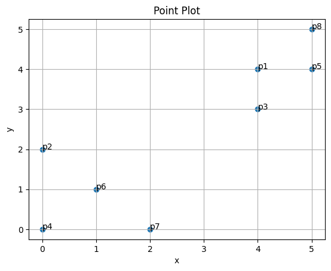
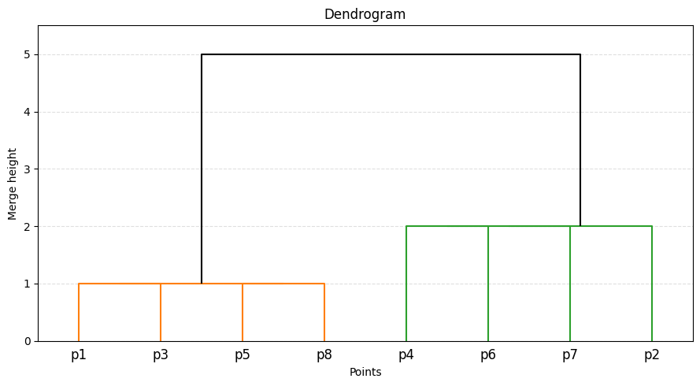

# 7.1 Clustering Algorithms: Worked Solution

Consider the same dataset:

| Point | $A_1$ | $A_2$ |
|:---|---:|---:|
| $p_1$ | 4 | 4 |
| $p_2$ | 0 | 2 |
| $p_3$ | 4 | 3 |
| $p_4$ | 0 | 0 |
| $p_5$ | 5 | 4 |
| $p_6$ | 1 | 1 |
| $p_7$ | 2 | 0 |
| $p_8$ | 5 | 5 |

The geometry of the points is useful before starting the calculations:

{width="5.2in"}

We use the Manhattan distance

$$
d_1(\mathbf{x},\mathbf{z})=\sum_j |x_j-z_j|.
$$

## 1. K-means with $k=2$

The initial centroids are the two points specified in the exercise:

$$
c_1=p_1=(4,4),\qquad c_2=p_6=(1,1).
$$

### Step 1: Assign every point to the closest initial centroid

For each point, compute its Manhattan distance to both centroids.

| Point | $d(p_i,c_1)$ | $d(p_i,c_2)$ | Assignment |
|:---|---:|---:|:---|
| $p_1=(4,4)$ | $0$ | $6$ | $C_1$ |
| $p_2=(0,2)$ | $6$ | $2$ | $C_2$ |
| $p_3=(4,3)$ | $1$ | $5$ | $C_1$ |
| $p_4=(0,0)$ | $8$ | $2$ | $C_2$ |
| $p_5=(5,4)$ | $1$ | $7$ | $C_1$ |
| $p_6=(1,1)$ | $6$ | $0$ | $C_2$ |
| $p_7=(2,0)$ | $6$ | $2$ | $C_2$ |
| $p_8=(5,5)$ | $2$ | $8$ | $C_1$ |

Therefore, after the first assignment step,

$$
C_1=\{p_1,p_3,p_5,p_8\},
\qquad
C_2=\{p_2,p_4,p_6,p_7\}.
$$

### Step 2: Recompute the centroids

For $C_1$:

$$
\mu_1=
\left(
\frac{4+4+5+5}{4},
\frac{4+3+4+5}{4}
\right)
=(4.5,4.0).
$$

For $C_2$:

$$
\mu_2=
\left(
\frac{0+0+1+2}{4},
\frac{2+0+1+0}{4}
\right)
=(0.75,0.75).
$$

### Step 3: Reassign the points using the new centroids

| Point | $d(p_i,\mu_1)$ | $d(p_i,\mu_2)$ | Assignment |
|:---|---:|---:|:---|
| $p_1$ | $0.5$ | $6.5$ | $C_1$ |
| $p_2$ | $6.5$ | $2.0$ | $C_2$ |
| $p_3$ | $1.5$ | $5.5$ | $C_1$ |
| $p_4$ | $8.5$ | $1.5$ | $C_2$ |
| $p_5$ | $0.5$ | $7.5$ | $C_1$ |
| $p_6$ | $6.5$ | $0.5$ | $C_2$ |
| $p_7$ | $6.5$ | $2.0$ | $C_2$ |
| $p_8$ | $1.5$ | $8.5$ | $C_1$ |

The assignments do not change, so the procedure has converged for this exercise.

The final result is therefore

$$
C_1=\{p_1,p_3,p_5,p_8\},\qquad \mu_1=(4.5,4.0),
$$

$$
C_2=\{p_2,p_4,p_6,p_7\},\qquad \mu_2=(0.75,0.75).
$$

> **ML insight: metric and representative**
>
> This exercise deliberately uses Manhattan distance together with arithmetic-mean updates to make the assignment/update mechanism explicit. Standard k-means is naturally associated with squared Euclidean distance and means. Under a pure $L_1$ objective, coordinate-wise medians lead to the k-medians analogue.

## 2. DBSCAN with $\varepsilon=1$ and $\mathrm{MinPts}=2$

DBSCAN classifies points according to the density of their local neighborhoods.

For this exercise, the $\varepsilon$-neighborhood is a closed neighborhood: points at distance exactly $1$ are included, and the point itself is counted. Therefore, with $\mathrm{MinPts}=2$, a point is core if it has at least one *other* point within Manhattan distance $1$.

### Step 1: Determine every $\varepsilon$-neighborhood

| Point | Coordinates | Other points with distance $\leq 1$ | $N_\varepsilon(p)$ | $|N_\varepsilon(p)|$ | Initial status |
|:---|:---:|:---|:---|---:|:---|
| $p_1$ | $(4,4)$ | $p_3,p_5$ | $\{p_1,p_3,p_5\}$ | 3 | Core |
| $p_2$ | $(0,2)$ | none | $\{p_2\}$ | 1 | Not core |
| $p_3$ | $(4,3)$ | $p_1$ | $\{p_3,p_1\}$ | 2 | Core |
| $p_4$ | $(0,0)$ | none | $\{p_4\}$ | 1 | Not core |
| $p_5$ | $(5,4)$ | $p_1,p_8$ | $\{p_5,p_1,p_8\}$ | 3 | Core |
| $p_6$ | $(1,1)$ | none | $\{p_6\}$ | 1 | Not core |
| $p_7$ | $(2,0)$ | none | $\{p_7\}$ | 1 | Not core |
| $p_8$ | $(5,5)$ | $p_5$ | $\{p_8,p_5\}$ | 2 | Core |

Thus,

$$
\text{core points}=\{p_1,p_3,p_5,p_8\}.
$$

### Step 2: Check border points

A border point is not core itself, but must lie within the $\varepsilon$-neighborhood of a core point.

The non-core points are $\{p_2,p_4,p_6,p_7\}$. None of them is within Manhattan distance $1$ of any core point. Therefore there are **no border points**.

### Step 3: Identify noise and clusters

All remaining non-core, non-border points are noise:

$$
\text{noise}=\{p_2,p_4,p_6,p_7\}.
$$

The four core points are density-connected through the links $p_3\leftrightarrow p_1\leftrightarrow p_5\leftrightarrow p_8$, so DBSCAN produces one cluster:

$$
\{p_1,p_3,p_5,p_8\}.
$$

> **ML insight: density is local**
>
> Unlike a centroid method, DBSCAN does not ask which representative is closest. It asks whether a point belongs to a sufficiently dense connected region. This is why points in sparse regions can be labelled as noise rather than being forced into a cluster.

## 3. Hierarchical Agglomerative Clustering with single link

In agglomerative clustering, every point starts as its own cluster. At each step, the two closest clusters are merged.

For **single-link** clustering, the distance between two clusters is the smallest pairwise distance between their members:

$$
d(C_a,C_b)=\min_{x\in C_a,\,z\in C_b}d_1(x,z).
$$

### Step 1: Smallest distances in the upper-right group

Several pairs have Manhattan distance $1$:

$$
d(p_1,p_3)=1,\qquad d(p_1,p_5)=1,\qquad d(p_5,p_8)=1.
$$

Because these distances are tied, several merge orders are equally valid. One valid sequence is:

1. merge $p_1$ and $p_3$ at height $1$;
2. merge $\{p_1,p_3\}$ with $p_5$ at height $1$;
3. merge $\{p_1,p_3,p_5\}$ with $p_8$ at height $1$.

This creates the upper-right cluster

$$
C_R=\{p_1,p_3,p_5,p_8\}.
$$

### Step 2: Smallest distances in the lower-left group

The relevant smallest distances are all $2$, for example

$$
d(p_2,p_4)=2,\quad d(p_2,p_6)=2,\quad d(p_4,p_6)=2,
$$

$$
d(p_4,p_7)=2,\quad d(p_6,p_7)=2.
$$

Again, because of ties, the exact internal order is not unique. One valid sequence is:

1. merge $p_2$ and $p_6$ at height $2$;
2. merge $\{p_2,p_6\}$ with $p_4$ at height $2$;
3. merge $\{p_2,p_4,p_6\}$ with $p_7$ at height $2$.

This creates

$$
C_L=\{p_2,p_4,p_6,p_7\}.
$$

### Step 3: Final merge

The smallest cross-group Manhattan distance is $5$, for example between $p_7=(2,0)$ and $p_3=(4,3)$:

$$
d_1(p_7,p_3)=|2-4|+|0-3|=2+3=5.
$$

Therefore, the final merge of $C_L$ and $C_R$ occurs at height $5$.

The resulting dendrogram is:

{width="5.6in"}

> **ML insight: single-link connectivity**
>
> Single-link clustering is driven by the closest pair across two clusters. It therefore builds clusters through connectivity and can create chaining effects. The dendrogram records the distance at which groups become connected. Ties mean that some internal merge orders are not unique even though the merge heights are.
