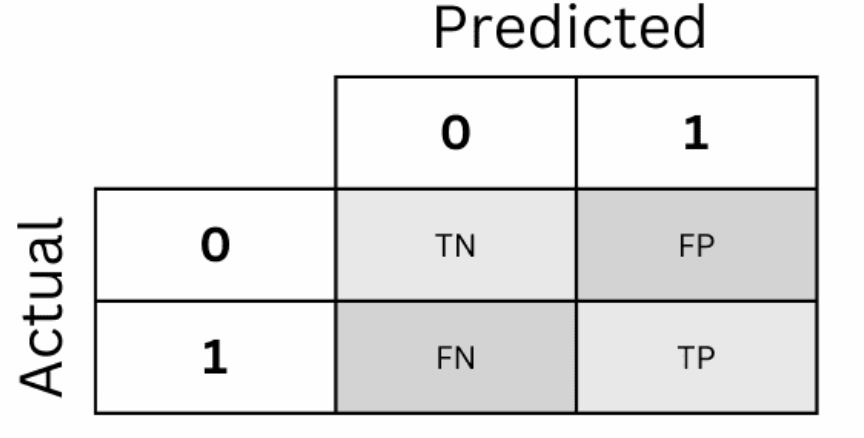

# 8.1 Ensembles

The true targets and the four classifier predictions are:

|                  | **ex1** | **ex2** | **ex3** | **ex4** | **ex5** | **ex6** | **ex7** | **ex8** | **ex9** | **ex10** |
|:---|---:|---:|---:|---:|---:|---:|---:|---:|---:|---:|
| **Target**  | **1** | **0** | **0** | **0** | **0** | **1** | **0** | **1** | **0** | **0** |
| **A** | 1 | 1 | 0 | 0 | 0 | 1 | 1 | 1 | 0 | 0 |
| **B** | 1 | 0 | 1 | 0 | 0 | 1 | 0 | 0 | 1 | 0 |
| **C** | 1 | 0 | 0 | 1 | 1 | 1 | 0 | 1 | 0 | 1 |
| **D** | 0 | 1 | 1 | 0 | 0 | 0 | 0 | 1 | 0 | 0 |

## 1. Individual classifier accuracy

For a binary classifier,

$$
\text{Accuracy}=\frac{\text{number of correct predictions}}{\text{number of examples}}.
$$

Comparing each row with the true targets gives:

| Classifier | Correct predictions | Accuracy |
|:---|---:|---:|
| A | 8/10 | 0.80 |
| B | 7/10 | 0.70 |
| C | 7/10 | 0.70 |
| D | 6/10 | 0.60 |

Classifier A is the best **individual classifier by accuracy** in this example.

## 2. Majority-vote ensembles

For each example, the ensemble outputs the class predicted by at least two of its three members.

| Ensemble | Majority-vote predictions for ex1–ex10 | Correct | Accuracy |
|:---|:---|---:|---:|
| A+B+C | 1, 0, 0, 0, 0, 1, 0, 1, 0, 0 | 10/10 | 1.00 |
| A+B+D | 1, 1, 1, 0, 0, 1, 0, 1, 0, 0 | 8/10 | 0.80 |
| A+C+D | 1, 1, 0, 0, 0, 1, 0, 1, 0, 0 | 9/10 | 0.90 |
| B+C+D | 1, 0, 1, 0, 0, 1, 0, 1, 0, 0 | 9/10 | 0.90 |

The best ensemble is A+B+C, with 100% accuracy.

## 3. Why can the ensemble outperform its members?

The best individual classifier, A, reaches 80% accuracy, whereas A+B+C reaches 100%. The improvement is possible because the three classifiers do not make the same mistakes on the same examples. When one member is wrong, the other two can still form a correct majority.

> **ML insight: diversity matters**
>
> A majority-vote ensemble benefits from **useful disagreement**: its members should be individually competent but should not systematically make the same errors. Majority voting cannot repair an error shared by most members.

# 8.2 Imbalanced Domain Learning

There are 20 examples: 18 negatives and 2 positives. Class 1 is the positive/minority class.

The confusion-matrix terms are:

| Term | Meaning |
|:---|:---|
| **TP** | predicted 1 and the true class is 1 |
| **FP** | predicted 1 but the true class is 0 |
| **FN** | predicted 0 but the true class is 1 |
| **TN** | predicted 0 and the true class is 0 |

{width="4.2in" fig-align="center"}

## 1. Confusion matrices

Read each prediction row against the true targets.

### Classifier A

A predicts class 0 for every example. Therefore:

- $TP=0$: no positive example is detected;
- $FP=0$: it never predicts a false positive;
- $FN=2$: both positive examples are missed;
- $TN=18$: all negative examples are correctly classified.

### Classifier B

B predicts both positives correctly, but also predicts four negatives as positive:

- $TP=2$;
- $FP=4$;
- $FN=0$;
- $TN=14$.

### Classifier C

C detects one of the two positives and creates no false positives:

- $TP=1$;
- $FP=0$;
- $FN=1$;
- $TN=18$.

### Classifier D

D detects one positive and incorrectly flags two negatives:

- $TP=1$;
- $FP=2$;
- $FN=1$;
- $TN=16$.

The four confusion matrices can therefore be summarized as:

| Classifier | TN | FP | FN | TP |
|:---|---:|---:|---:|---:|
| A | 18 | 0 | 2 | 0 |
| B | 14 | 4 | 0 | 2 |
| C | 18 | 0 | 1 | 1 |
| D | 16 | 2 | 1 | 1 |

## 2. Accuracy, precision, recall, and F1-score

Use

$$
\text{Accuracy}=\frac{TP+TN}{TP+TN+FP+FN},
$$

$$
\text{Precision}=\frac{TP}{TP+FP},
\qquad
\text{Recall}=\frac{TP}{TP+FN},
$$

$$
F_1=2\frac{\text{Precision}\cdot\text{Recall}}{\text{Precision}+\text{Recall}}.
$$

### Classifier A

$$
\text{Accuracy}=\frac{18}{20}=0.90,
$$

but it never predicts the positive class, so

$$
\text{Precision}=0,\qquad \text{Recall}=0,\qquad F_1=0.
$$

### Classifier B

$$
\text{Accuracy}=\frac{14+2}{20}=0.80,
$$

$$
\text{Precision}=\frac{2}{2+4}=\frac13\approx0.33,
$$

$$
\text{Recall}=\frac{2}{2+0}=1.00,
$$

$$
F_1=2\frac{(1/3)(1)}{1/3+1}=0.50.
$$

### Classifier C

$$
\text{Accuracy}=\frac{18+1}{20}=0.95,
$$

$$
\text{Precision}=\frac{1}{1+0}=1.00,
\qquad
\text{Recall}=\frac{1}{1+1}=0.50,
$$

$$
F_1=2\frac{(1)(0.5)}{1+0.5}\approx0.67.
$$

### Classifier D

$$
\text{Accuracy}=\frac{16+1}{20}=0.85,
$$

$$
\text{Precision}=\frac{1}{1+2}=\frac13\approx0.33,
\qquad
\text{Recall}=\frac{1}{1+1}=0.50,
$$

$$
F_1=2\frac{(1/3)(0.5)}{1/3+0.5}=0.40.
$$

The final comparison is:

| Classifier | Accuracy | Precision | Recall | $F_1$ |
|:---|---:|---:|---:|---:|
| A | 0.90 | 0.00 | 0.00 | 0.00 |
| B | 0.80 | 0.33 | 1.00 | 0.50 |
| C | 0.95 | 1.00 | 0.50 | 0.67 |
| D | 0.85 | 0.33 | 0.50 | 0.40 |

## 3. Which classifier should be selected?

There is no context-free answer.

If **false negatives are extremely costly**, Classifier B is the natural choice among these four because its recall is 1.00: it finds both positive examples. The cost is four false positives and lower overall accuracy.

If **false positives are very costly**, but detecting at least some positive examples is required, Classifier C is attractive. It produces no false positives and detects one of the two positives. The trade-off is recall 0.50: one positive example is missed.

Classifier A is the key counterexample to selecting by accuracy alone. It achieves 90% accuracy despite detecting **none** of the minority examples. The high accuracy is produced simply by exploiting the majority-class frequency.

> **ML insight: metrics encode different error preferences**
>
> Accuracy measures overall correctness. Recall focuses on missed positives, precision focuses on false alarms, and $F_1$ balances precision and recall symmetrically. None of these metrics defines a universally optimal classifier without first specifying which mistakes matter.
